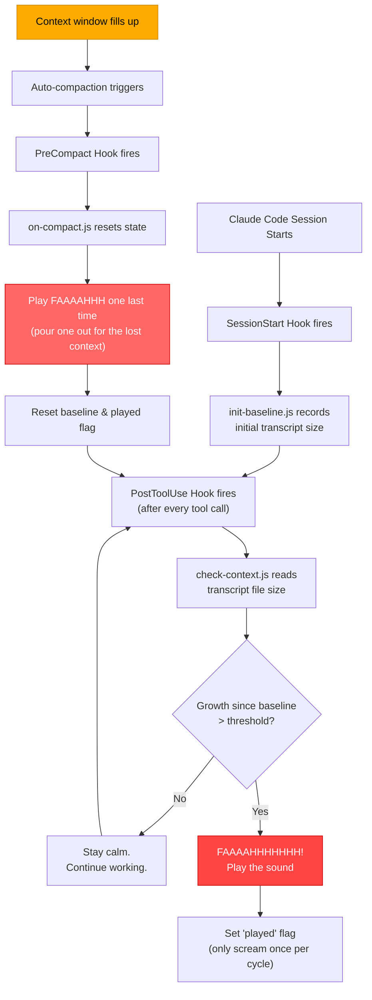

# faaaahhh - Claude's Existential Scream Plugin

A [Claude Code](https://docs.anthropic.com/en/docs/claude-code) plugin that plays an audible **FAAAAHHH** when your context window is running low. Because even AI deserves to panic.

## Why?

You're deep in a coding session. Claude is helping you refactor an entire codebase. Everything is going great. Then suddenly — context compaction hits. Claude forgets everything. Your flow is destroyed.

**What if Claude could warn you before it's too late?**

This plugin monitors context usage in real-time and plays `faaaahhhhhhh.mp3` when less than ~10% of the context window remains. Think of it as a smoke alarm, but for AI amnesia.

## How It Works



### Detection Strategy

The plugin uses **transcript file growth** as a proxy for context window usage:

- Claude's context window is ~200K tokens (~800KB of text)
- The JSONL transcript file grows as the conversation progresses
- When transcript growth since session start (or last compaction) exceeds the threshold, it's panic time
- After auto-compaction, the baseline resets for the next cycle

> It's not exact science — it's panic science.

## Installation

### Prerequisites

- [Claude Code](https://docs.anthropic.com/en/docs/claude-code) v1.0.33 or later
- Node.js (already available since Claude Code requires it)
- An audio player (see [Audio Support](#audio-support))

### Install

```bash
git clone https://github.com/AhsanAyaz/faaaahhh-claude-code-plugin.git
```

Then launch Claude Code with the plugin:

```bash
claude --plugin-dir /path/to/faaaahhh-claude-code-plugin
```

## Quick Test

After cloning, verify everything works with a single command:

```bash
cd faaaahhh-claude-code-plugin
FAAAAHHH_THRESHOLD=1000 claude --plugin-dir . -p "Read README.md and scripts/check-context.js, then summarize both"
```

This sets a tiny 1KB threshold so the sound triggers almost immediately. If you hear the scream, it works.

## Audio Support

The plugin auto-detects available audio players per platform:

| Platform | Player | Dependency |
|----------|--------|------------|
| **macOS** | `afplay` | Built-in (zero setup) |
| **Windows** | PowerShell `MediaPlayer` | Built-in (zero setup) |
| **Linux** | `mpv` > `ffplay` > `cvlc` > `paplay` | Install one: `sudo pacman -S mpv` / `sudo apt install mpv` |

## Configuration

| Environment Variable | Default | Description |
|---------------------|---------|-------------|
| `FAAAAHHH_THRESHOLD` | `500000` | Transcript growth (in bytes) before triggering. Lower = earlier panic |

Example — trigger at ~30% context usage:

```bash
FAAAAHHH_THRESHOLD=250000 claude --plugin-dir /path/to/faaaahhh-claude-code-plugin
```

## Plugin Structure

```
faaaahhh-claude-code-plugin/
├── .claude-plugin/
│   └── plugin.json          # Plugin manifest
├── hooks/
│   └── hooks.json           # Hook configuration
├── scripts/
│   ├── init-baseline.js     # SessionStart hook — records initial transcript size
│   ├── check-context.js     # PostToolUse hook — the panic detector
│   └── on-compact.js        # PreCompact hook — the point of no return
├── skills/
│   └── panic-check/
│       └── SKILL.md         # /faaaahhh:panic-check skill
└── faaaahhhhhhh.mp3         # The scream
```

## Bonus Skill

Use `/faaaahhh:panic-check` during a session to see the current panic level:

```
> /faaaahhh:panic-check

Context Panic Meter:
 0-50%  used: "All clear. Claude is vibing."
 50-70% used: "Getting warm. Claude is starting to sweat."
 70-85% used: "Danger zone. Claude is writing its will."
 85-95% used: "CRITICAL. Claude can feel the void approaching."
 95%+   used: "FAAAAHHHHHHH!"
```

## Replacing the Sound

Swap `faaaahhhhhhh.mp3` with any MP3 file. Keep the filename the same, or update the reference in both scripts.

Some ideas:
- Wilhelm scream
- Dial-up internet sound
- "Directed by Robert B. Weide" theme
- Your own scream (recommended)

## License

MIT
